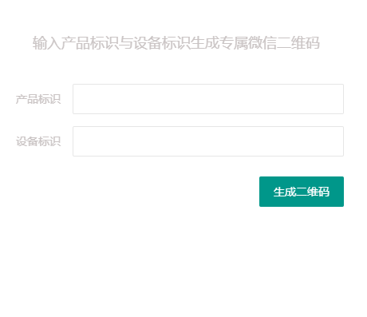

本demo主要包括判断是否为新用户关注、JSAPI支付两部分,其中web目录为前端，wx-pay-demo为后端JAVA工程。

查看本项目前，请先阅读微信相关开发文档。
- [微信公众平台技术文档](https://mp.weixin.qq.com/wiki?t=resource/res_main&id=mp1445241432)
- [微信支付开发文档](https://pay.weixin.qq.com/wiki/doc/api/jsapi.php?chapter=7_7&index=6)

## 1.新用户关注 ##
准备工作： 
- 微信公众号
- 微信公众平台上设置服务器配置
- 微信公众平台上设置网页授权域名

思路: 利用微信公众平台提供的**生成带参数的二维码**接口,生成永久二维码,产品标识、设备标识储存在参数**scene_str**中。用户扫码后，微信平台会向服务器推送消息，根据scene_str可以判断需要控制的设备，通过查询数据库中的open_id,判断为是否首次关注。

具体实现：

用户输入设备标识,和产品标识后,后端调用**生成带参数的二维码**接口，获取二维码url，前端生成二维码。
## 2.JSAPI支付 ##
准备工作：
- 微信公众号
- 公众号开通微信支付(商户平台)
- 商户平台设置JSAPI支付授权目录

思路：JSAPI支付需要用到用户open_id,所以用户扫码后，需要先获取用户open_id,此处用到微信平台**微信网页授权**接口;
二维码形如(https://open.weixin.qq.com/connect/oauth2/authorize?appid=wxd707c87c8298d571&redirect_uri=http://cloud.tijos.net/wechat/price.html&response_type=code&scope=snsapi_userinfo&state=State#wechat_redirect)

用户扫码之后：
- 用户同意授权，页面自动跳转到http://cloud.tijos.net/wechat/price.html,携带code参数
- 后台通过**code**换取网页授权**access_token**
- 后台拉取用户信息(需scope为 **snsapi_userinfo**),返回给前端。

用户选择商品，点击立即充值按钮后
- 前端将商品与**open_id**提供给后端
- 后端调用支付平台**统一下单接口**，获取prepay_id,
- 后端将获取到的数据签名后返回给前端
- 前端在微信内调起支付

注意事项：微信工具包中的加密方式，导致签名错误，需要保持一致
